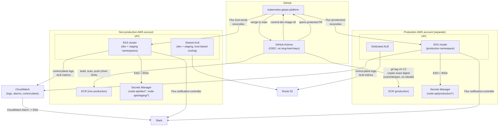

# Architecture — AWS production target design

## Key properties

- **Two EKS clusters, two AWS accounts**: production is fully isolated —
  separate control plane, failure domain, network boundary, IAM boundary.
  Non-production hosts dev and staging as namespaces on one cluster to
  control cost.
- **Each cluster runs its own Flux installation**, watching only its own
  GitOps path (`gitops/apps/node-api/{dev,staging}` for non-prod,
  `gitops/apps/node-api/production` for prod). Production does not depend
  on non-production Flux in any way.
- **CI never has cluster-admin.** GitHub Actions authenticates to AWS via
  OIDC with two narrowly-scoped roles: one for non-production ECR push
  (`ci-nonprod`), one for the production digest-copy promotion step only
  (`ci-prod-promotion`) — see `infra/modules/iam/github-oidc.tf`. Neither
  role can reach the Kubernetes API; only Flux, running inside the
  cluster, deploys anything.
- **Build once, promote by digest**: the image built and scanned for
  non-production is the exact same digest promoted to production —
  `docker/node-api:v1.4.0@sha256:...` — never rebuilt.
- **IRSA everywhere AWS access is needed** (ESO, ExternalDNS, ALB
  controller, Karpenter, EBS CSI driver) — the application pod itself
  receives zero AWS IAM permissions.

See `docs/networking.md`, `docs/secrets.md`, `docs/cost.md`, and
`docs/disaster-recovery.md` for the reasoning behind each piece.
