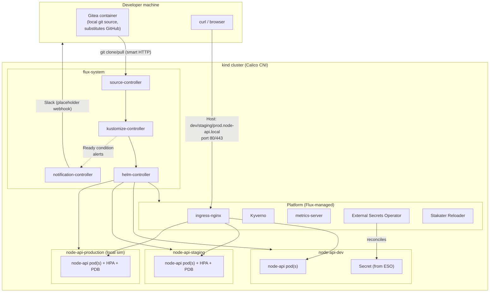

# Architecture — local kind demo

## What's real vs. simulated

| Component            | Local demo                                   | AWS production target                        |
|-----------------------|-----------------------------------------------|------------------------------------------------|
| Git source             | Gitea container (smart HTTP)                   | Published GitHub repository                    |
| Container registry      | GHCR (or `kind load docker-image` for offline) | GHCR (non-prod) + private ECR (production)    |
| Ingress                 | ingress-nginx, host-mapped ports 80/443         | AWS Load Balancer Controller, ALB              |
| Secrets backend          | Kubernetes `Secret` (ESO `kubernetes` provider) | AWS Secrets Manager (ESO `aws` provider, IRSA) |
| Node provisioning         | Single kind node                                | Managed node group + Karpenter                 |
| CNI                       | Calico (installed imperatively, see docs/gitops.md) | VPC CNI (EKS-managed addon)                |
| Namespaces                 | All three (dev/staging/production) on one cluster | dev+staging on non-prod cluster, production on its own cluster/account |

The Flux reconciliation graph, Helm chart, Kyverno policies, RBAC,
SecurityContext, HPA, PDB, and NetworkPolicy are identical in both — only
the pieces above differ, and each difference is a Helm values override,
not a different chart or different Flux mechanics.
